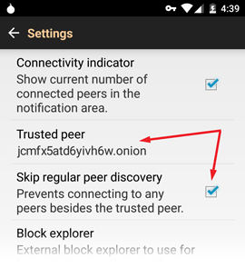
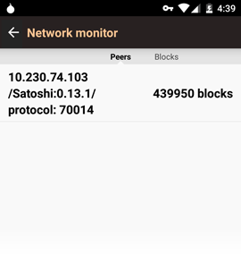

[draft] Bitcoin mobile privacy via Trusted peer connection over Tor
===================================================================

TL;DR; This guide will help you easily configure an Android Bitcoin Wallet to relay transactions via a trusted Full Node using Tor, therefore mitigating the most important security and privacy concerns on mobile devices.

## Intro

Bitcoin mobile clients generally offer significantly reduced security and privacy in comparison to a full node. For many users, this is an unfortunate, but seemingly necessary usability compromise. Wallets have attempted to address the issues in several ways, but all have significant downsides. This guide presents a practical setup for enhanced privacy and security on mobile devices. Specifically, the guide below describes how to use the [Bitcoin Wallet for Android](https://play.google.com/store/apps/details?id=de.schildbach.wallet) and its "Trusted peer" option with a Tor hidden service to avoid several critical issues without sacrificing usability.  This guide does not cover any of the issues related to endpoint security (keeping your Android device and full node secure) or analysis of the Bitcoin blockchain.

Contents:
* [Background](#background)
* [Setup & Configuration](#setup--configuration)
* [Final thoughts and alternatives](#final-thoughts-and-alternatives)

## Background

#### Privacy:
Privacy in the context of Bitcoin is a complex, multifaceted issue.  Here we will be focusing on addressing [privacy issues related to Bloom filters](https://eprint.iacr.org/2014/763.pdf), passive surveillance of transactions and capturing of IP addresses that broadcast a transaction.  Basically everything that happens before transactions are collected by miners and written to the blockchain.  There are many other privacy issues in the context of blockchain analysis, but those can be addressed in other ways and are out of scope for this document.

Issues with SPV clients and Bloom filters:

1. The Bitcoin Wallet for Android, relies on [Bloom filters](https://github.com/bitcoin/bips/blob/master/bip-0037.mediawiki) to protect user privacy.  However it has been demonstrated that this is ineffective and connected peers can easily discover which addresses are owned by the user.
2. A passive observer controlling many nodes can pinpoint the IP address of the node which is first to broadcast a transaction. This information can then be used for geolocation, address clustering, etc.  This is unrelated to Bloom filter information leakage, but can be used to further enhance an attack.  Bitcoin full nodes are less vulnerable to this sort of data collection because they are constantly replaying not only their own transactions, but all transactions on the network.

#### Security:
Without access to the full blockchain, payments can potentially be blocked and peers can hypothetically lie about (withhold) transactions from SPV clients.

### Trusted peer:
The original Bitcoin Wallet for Android introduced a so called **Trusted peer** option allowing the wallet to communicate directly with a full node which the user presumably controls. This theoretically offers the benefits of a full node on a light client (assuming your connection to the node is secure).

In order to prevent a [Man In The Middle attack](https://en.wikipedia.org/wiki/Man-in-the-middle_attack), the connection to the "Trusted peer" must be secure - ie both authenticated and encrypted.  However, it is left to the user to figure out this crucial piece.

## Approach presented here:
Trusted peer connecting to self hosted Tor hidden service.

Benefits:

1. Provides **authentication** as the hidden service name itself is derived from the public key, preventing impersonation.

2. All **traffic is encrypted** preventing passive surveillance.

3. Data packets are **protected against manipulation** by intermediate nodes.

4. The Tor network hides the user’s IP address.  This frustrates attempts to **geolocate transactions** and **clustering Bitcoin addresses** per IP address.

5. If you own the trusted peer, then you know a **third party is not monitoring transactions** before they are broadcast on the Bitcoin network.

Essentially we resolve the most significant issues inherent in a mobile wallet client using existing software.

# Setup & Configuration

## Trusted peer
This setup will require a [Bitcoin Core full node](https://bitcoin.org/en/full-node) which you trust, ie a secure desktop computer (ideally running Linux, etc) and available 24/7.  Can also be a close friend you trust not to spy on your transactions or make stupid configuration errors.  Although it is possible to host the full node on a remote server (ie Digital Ocean), this will undermine the trustlessness we are trying to achieve here, so it is not recommended.  You will also run a Tor proxy on the system allowing your mobile to connect securely to the server.

1. Install and [configure Tor](https://www.torproject.org/docs/installguide.html.en) and ensure it is properly routing traffic over the Tor network.
2. [Install Bitcoin Core](https://bitcoin.org/en/download).  The wallet can be disabled, you only need `bitcoind`.
3. [Configure Bitcoin Core to run as a Tor hidden service](https://github.com/bitcoin/bitcoin/blob/master/doc/tor.md).
4. Use the Tor hidden service as the "Trusted peer" as shown in the Android Bitcoin Wallet screen shots below.

Once you have it all setup, you can [check your Tor hidden service is recognized on the bitcoin network](https://bitnodes.21.co/nodes/) and then configure your mobile to use the `.onion` address as shown below.

## Android
You will need to install [Orbot](https://play.google.com/store/apps/details?id=org.torproject.android) (Tor Client for Android) and [Bitcoin Wallet for Android](https://play.google.com/store/apps/details?id=de.schildbach.wallet).

#### Setup Bitcoin Wallet Trusted peer

Once the **Trusted peer** is configured with your `.onion` hidden service, you will see only a single node connected on a private IP address (`10.xx.xx.xx` in this example).

#### Setup Orbot

Use Orbot's **Apps VPN Mode** which allows the wallet app to connect to your Tor hidden service.

# Final thoughts and alternatives

This is by no means the only way to safely run a Bitcoin light client.

Here are a couple other possibilities:

1. [Electrum for Android](https://play.google.com/store/apps/details?id=org.electrum.electrum) with your own Electrum server.
2. Use a standard VPN or SSH tunnel to route traffic over secure connection from your mobile device to your own full node.

Both options may also use Tor to further obfuscate your IP address.

### Disclaimer

This document has not been reviewed for accuracy and comes with no guarantees. There may be other metadata, etc. which is leaked via this setup -- **[Feedback is welcome!](https://github.com/jonathancross/jc-docs/issues/new?title=Feedback: Bitcoin mobile privacy)**
